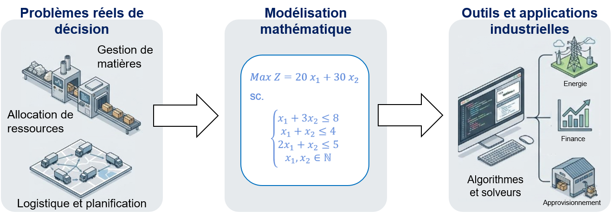
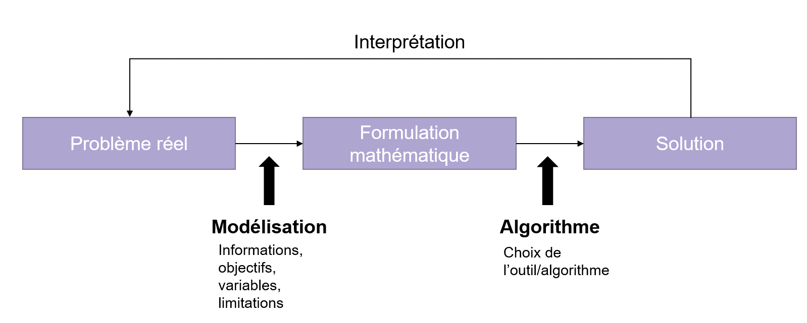

# Introduction à la recherche opérationnelle

* Elle trouve ses origines dans les travaux de cherchers tels que Léonid Kantorovich et George DANTZIG, qui ont développé les premiers modèles formels dans les années 1940.
* Technique utilisée à l’époque pour organiser la logistique de certaines opérations militaires. 
* L'efficacité  de cet outil de calcul,  jointe à la possibilité d'utiliser l'ordinateur, permet d’employer la PL pour résoudre des problèmes relevant de divers domaines (transport, télécommunications, logistique, etc.).  

# Méthodologie de la recherche opérationnelle

# Objectifs du workshop 
1. Savoir modéliser des problèmes 
2. Savoir résoudre des problèmes linéaires 
    * Méthodes graphiques 
    * Solveur 

# ROADMAP du workshop 
1. Introduction à la programmation linéaire : Concepts fondamentaux. 
2. Modélisation d'un premier problème à deux variables : Fabrication de yaourts.
3. Résolution graphique. 
4. Modélisation d'un problème à n variables : Usine d'aciers. 
5. Résolution avec un solveur. 
6. Programmation linéaire en nombres entiers : Gestion de bibliothèque musicale. 
7. Synthèse : Limites des méthodes vues et ouverture vers l'optimisation avancée. 
