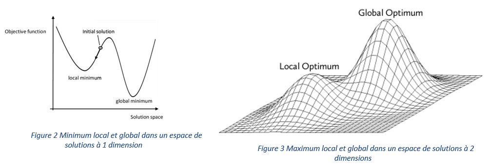

# Séquence de préparation : Prise en main de Python

Thèmes : listes, boucles, fonctions, module random, module matplotlib, lecture/écriture fichier, complexité algorithmique.

## Objectifs pédagogiques

Dans cette séquence, vous allez :

- manipuler des tuples contenant des données statistiques
- écrire des fonctions de base : max, min, somme, moyenne, etc.
- exploiter des données météorologiques de plusieurs villes françaises
- afficher et analyser des graphiques avec `matplotlib`
- éventuellement enrichir les données avec vos propres valeurs
# Boucle 1 : Théorie des graphes

Dans cette partie, nous avons introduit les bases de la théorie des graphes.

## Objectifs pédagogiques  
- Définition d’un graphe (sommets et arêtes)
- Deux modes de représentation :
    - Matrice d’adjacence
    - Liste d’adjacence

# Boucle 2 : Complexité des problèmes d'optimisation
Cette boucle est consacrée à la compréhension de la complexité algorithmique des problèmes d’optimisation.

## Objectifs pédagogiques  
- pourquoi certains problèmes sont difficiles à résoudre ?
- pourquoi on utilise des méthodes approchées dans certains cas ?

# Boucle 3 : Introduction à la recherche opérationnelle

* Elle trouve ses origines dans les travaux de cherchers tels que Léonid Kantorovich et George DANTZIG, qui ont développé les premiers modèles formels dans les années 1940.
* Technique utilisée à l’époque pour organiser la logistique de certaines opérations militaires. 
* L'efficacité  de cet outil de calcul,  jointe à la possibilité d'utiliser l'ordinateur, permet d’employer la PL pour résoudre des problèmes relevant de divers domaines (transport, télécommunications, logistique, etc.).  

## Méthodologie de la recherche opérationnelle

## Objectifs du workshop 3
1. Savoir modéliser des problèmes 
2. Savoir résoudre des problèmes linéaires 
    * Méthodes graphiques 
    * Solveur 

## ROADMAP du workshop 3
1. Introduction à la programmation linéaire : Concepts fondamentaux. 
2. Modélisation d'un premier problème à deux variables : Fabrication de yaourts.
3. Résolution graphique. 
4. Modélisation d'un problème à n variables : Usine d'aciers. 
5. Résolution avec un solveur. 
6. Programmation linéaire en nombres entiers : Gestion de bibliothèque musicale. 
7. Synthèse : Limites des méthodes vues et ouverture vers l'optimisation avancée. 

# Boucle 4 : Métaheuristiques

Dans cette partie, nous abordons les méthodes d’optimisation avancées, notamment lorsque les approches exactes deviennent inefficaces.

Contrairement à la programmation linéaire, les métaheuristiques permettent de traiter des problèmes : 
- complexes
- de grande taille 
- souvent NP-difficiles

# Objectifs pédagogiques

- Introduire les métaheuristiques à travers la résolution du problème du sac à dos (Knapsack Problem).
- Comprendre la différence entre un optimum local et global

On y construit progressivement :

1. une modélisation du problème
2. les structures de données adaptées
3. les fonctions de base
4. Implémentation de deux métaheuristiques : Hill Climbing & Tabu search
